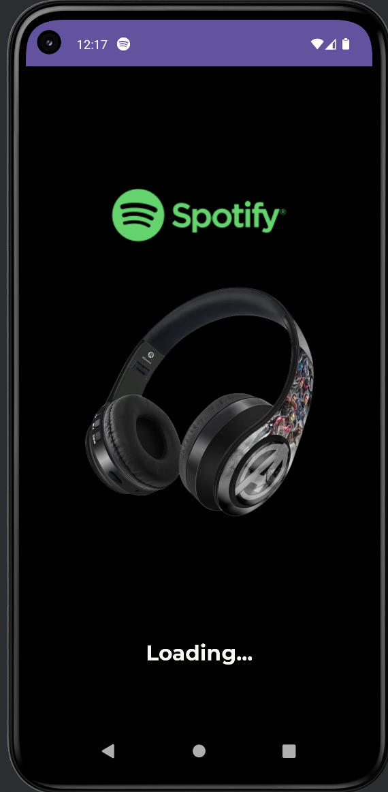
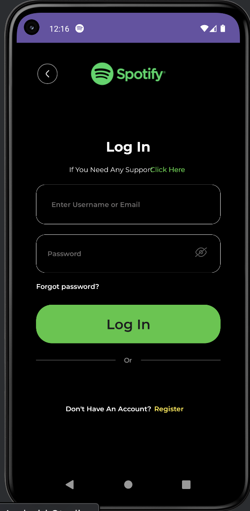
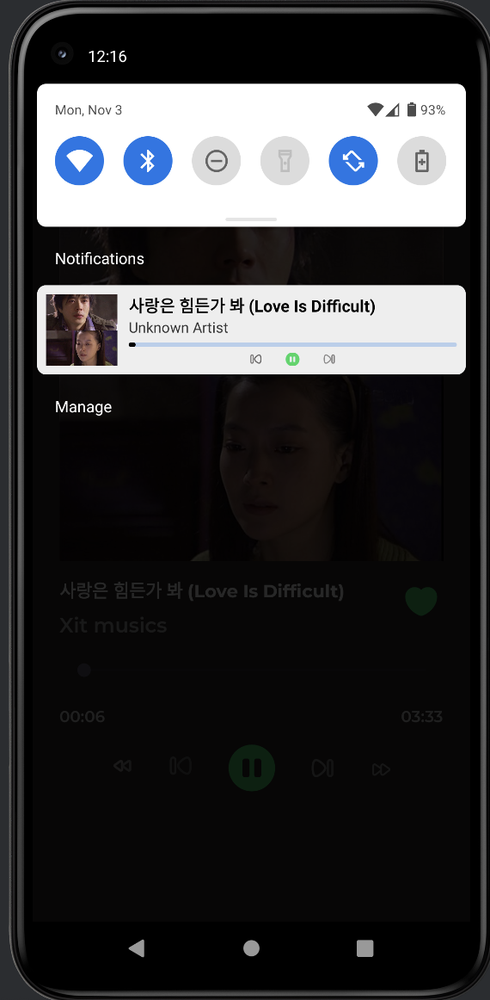
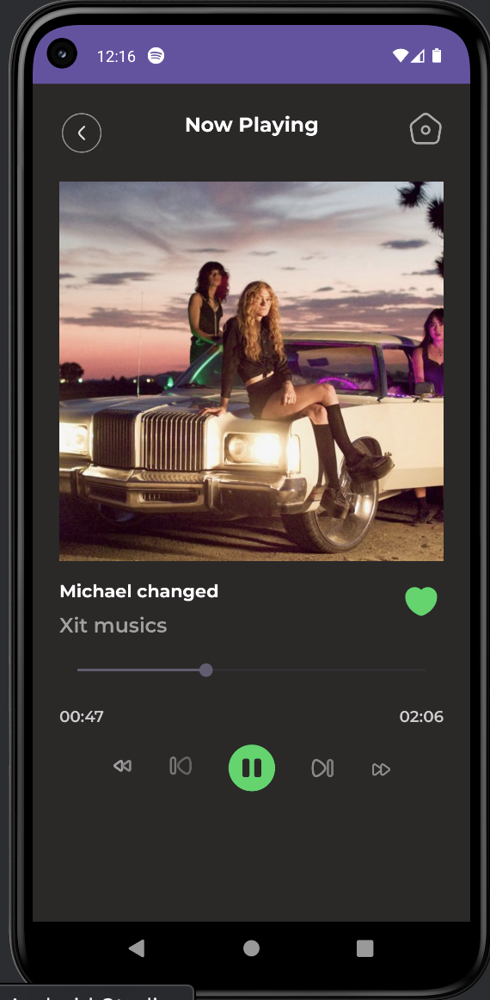

# 🎧 Spofity — Android Music Player Clone

A custom **Spotify-style MP3 Player App** built with **Kotlin**, featuring real-time music control through **foreground service**, **notification with progress bar**, and **broadcast updates**.

---

## 📱 Screenshots

  
  
  
  

*(👉 Replace the image names with your real screenshots if needed.)*

---

## 🧩 Key Features

- 🎶 **Play / Pause / Next / Previous** music controls
- ⚙️ **Foreground Service** for background playback
- 🔔 **Custom Notification** with progress bar and remote views
- ⏱️ **Real-time Seekbar Update** using `Handler`
- 📡 **BroadcastReceiver** to send and receive playback updates
- 🧭 **Auto-next track** when the current song ends
- 🪄 Smooth and lightweight UI with responsive controls

---

## 🏗️ Tech Stack

| Component | Description |
|------------|--------------|
| **Kotlin** | Main programming language |
| **MediaPlayer** | Handles music playback |
| **Service** | Keeps playback alive in the background |
| **NotificationCompat + RemoteViews** | Custom notification UI with play/pause, next, and previous buttons |
| **PendingIntent** | Manages user interaction from notification buttons |
| **Handler** | Updates playback progress in real-time |
| **BroadcastReceiver** | Communicates updates between service and activity |

---

---

## 🚀 How It Works

1. When you press **Play**, the app starts a **Foreground Service** that initializes a `MediaPlayer`.
2. A **custom notification** appears with real-time progress and control buttons.
3. The **Handler** continuously updates playback progress (every 500ms).
4. All changes (like play, pause, next, previous) trigger **Broadcasts** to update the UI.
5. When playback ends, the next track automatically starts.

---

## 🧠 Highlights

- Fully dynamic music controller
- Background-safe playback
- Smooth UI synced with notification
- Example of a professional **Spotify clone logic** in Kotlin
- Ideal for studying Android **Service**, **Notification**, and **MediaPlayer** integration

---

## 🧰 Requirements

- Android Studio Arctic Fox (or newer)
- Min SDK 26+
- Kotlin 1.8 or higher

---

## 📘 Reference

Inspired by **Spotify UI** and Android **Chapter 4. 복습**:
- MediaPlayer
- Service
- Notification
- BroadcastReceiver
- PendingIntent
- RemoteViews

---

## 👨‍💻 Author

Developed by **Ismoil**  
GitHub: [@ismoil201](https://github.com/ismoil201)  
Project: **Spofity Clone App**

